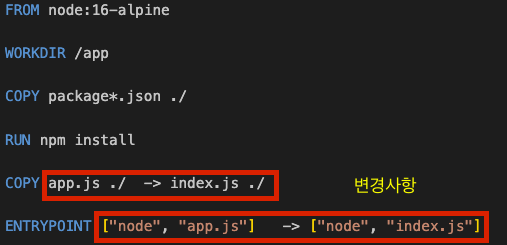
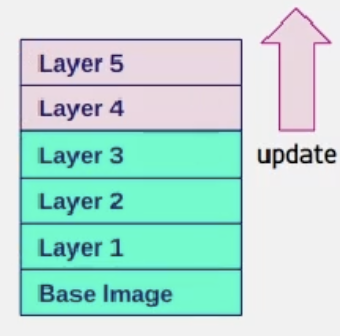
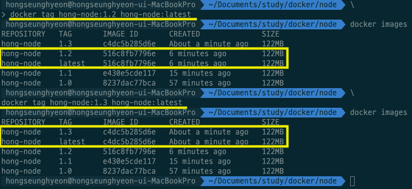

### docker의 layer Cache 확인하기




<br><br><br>

### 9번에서 만든 app.js 파일을 index.js 파일로 그대로 복사
```
cp app.js index.js
```

### Dockerfile 수정
```
FROM node:16-alpine

WORKDIR /app           

COPY package*.json ./

RUN npm install   

COPY index.js ./

ENTRYPOINT ["node", "index.js"]
```

### docker build 하기
```
docker build -f Dockerfile -t hong-node:1.1 .
```
- 이전에 비해 훨씬 빠르게 docker build 과정이 진행했을 것이다.
    >  => CACHED [2/5] WORKDIR /app                                                                     0.0s <br>
 => CACHED [3/5] COPY package*.json ./                                                            0.0s<br>
 => CACHED [4/5] RUN npm install

- 캐시를 사용하지 않고 build를 하고 싶다면?
    > docker build -f Dockerfile **--no-cache** -t hong-node:1.2 .

<br><br><br>

### versioning
- docker image에 tag를 붙이지 않으면 기본적으로 latest 가 설정된다.
- 때문에 최신버전을 관리하기 위해서는,
    > docker tag [원하는 image] [registry username]/[image name]:latest

- 예시
    

    