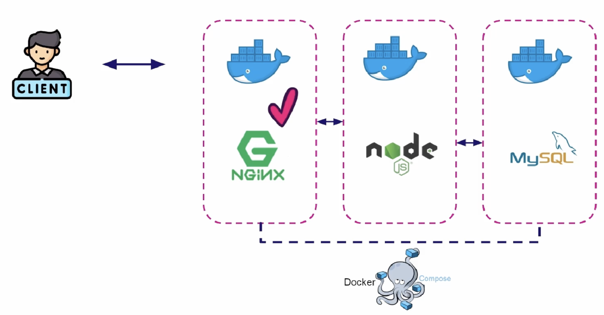
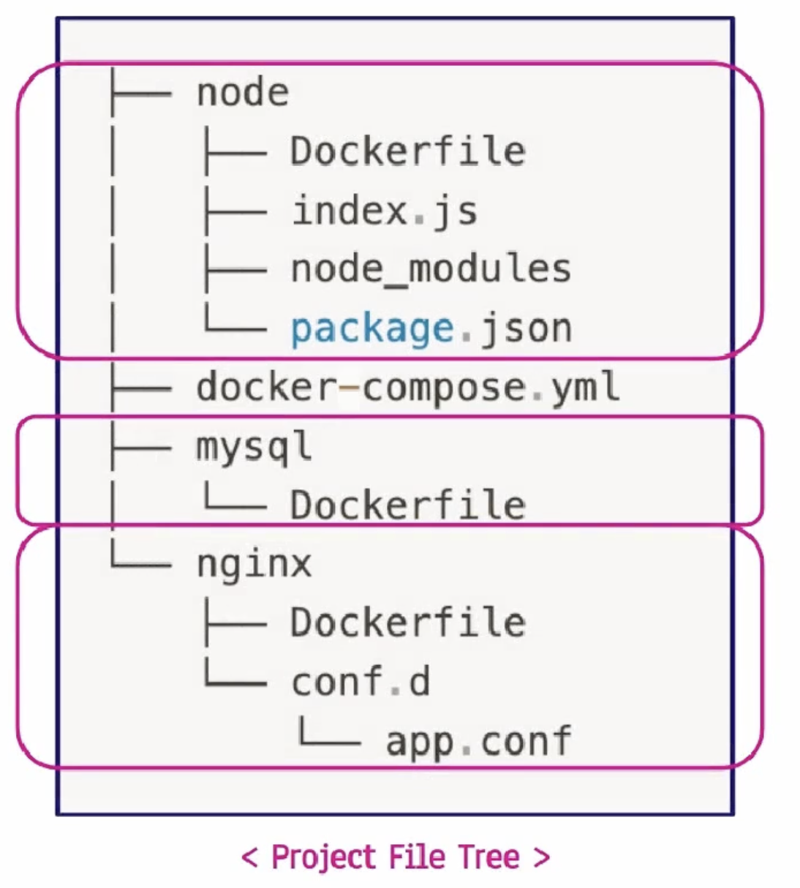
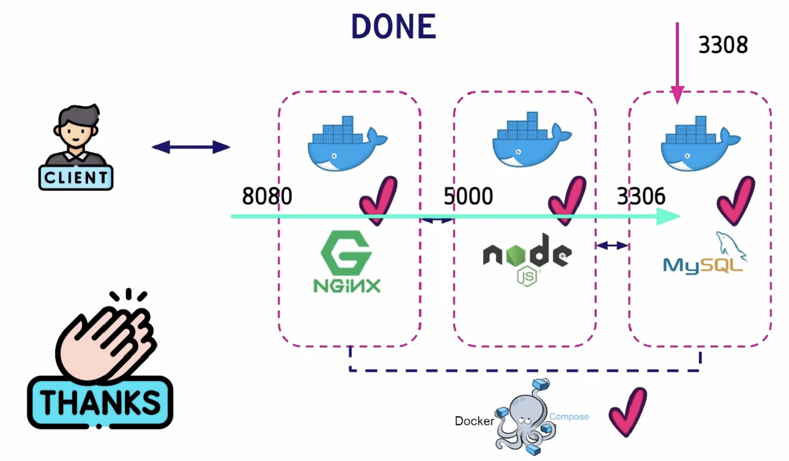

### architecture

- nginx
    - reverse proxy 역할
    - traffic이 많은 서버의 부하를 분산
    - was의 부하를 줄여주는 Load balance 역할의 프로그램
- node js
- rdbms
- docker-compose
    - 여러 개의 container 환경을 다루도록 도와줌

### Preview

1. running nginx container
2. running node js container
3. running mysql container
4. docker-compose setting

### running nginx container
- nginx/Dockerfile
    ```
    FROM nginx
    COPY conf.d/app.conf /etc/nginx/conf.d/default.conf
    ```

- nginx/conf.d/app.conf
    ```
    server {
        listen 8080;

        location / {
            proxy_set_header Host $host;
            proxy_set_header X-Real-IP $remote_addr;
            proxy_set_header X-Forwarded-For $Proxy_add_x_forwarded_for;
            proxy_set_header X-Forwarded-Proto $scheme;

            proxy_pass http://test_app:5000;
        }
    }
    ```
    * test_app : docker-compose 에 설정한 server name

### running node js container
- commands
    ```
    npm init
    npm install --save mysql
    npm install --save express
    ```

- node/Dockerfile
    ```
    FROM node:16-alpine
    
    WORKDIR /app
    
    COPY package*.json ./
    
    RUN npm install

    COPY index.js ./
    
    ENTRYPOINT ["node", "index.js"]
    ```

- index.js
    ```
    const mysql = require('mysql');
    const express = require('express');
    const app = express();
    const PORT = 5000;

    app.get('/', (req, res)=> res.send('Hi Node JS'));

    app.get('/health', (req, res)=>{
        if(!pool){
            var pool = mysql.createPool({
                host: "docker-mysql",
                user: "root",
                password: "1234",
                database: "nodeprac",
                port: "3306"
            });
        }

        pool.getConnection((err, connection)=>{
            if(err){
                console.log(err);
                res.send(err.message);
            } else {
                connection.release();
                res.send("db connection success");
            }
        });
    });

    app.listen(PORT, (req, res)=> {
        console.log('node js server is running');
    });
    ```

- running mysql container

    ```
    FROM mysql/mysql-server:5.7

    CMD ["mysqld"]
    ```

- docer compose setting
    ```
    version: '3.8'

    services:

        test_web:
            restart: always
            build:
                context: ./nginx
            ports:
                - "8080:8080"
            depends_on:
                - test_app
        
        test_app:
            restart: always
            build:
                context: ./node
            ports:
                - "5000:5000"
            expose:
                - 5000      # host 내부 다른 컨테이너들만 액세스 가능
            depends_on:
                - test_db
        
        test_db:
            restart: unless-stopped
            # unless-stopped : 강제로 멈추기전까지 항상 재시작
            # no : 실행하지 않음
            # always : 항상 재시작

            build:
                context: ./mysql
            hostname: "docker-mysql"
            ports:
                - "3308:3306"
            envirnment:
                MYSQL_DATABASE: nodeprac
                MYSQL_ROOT_HOST: '%'
                MYSQL_ROOT_PASSWORD: 1234
    ```

    ### docker-compose 실행 및 정지
    ```
    docker compose (docker-compose.yml) up // foreground
    docker compose up -d // background

    docker compose down
    ```


    ### final
    