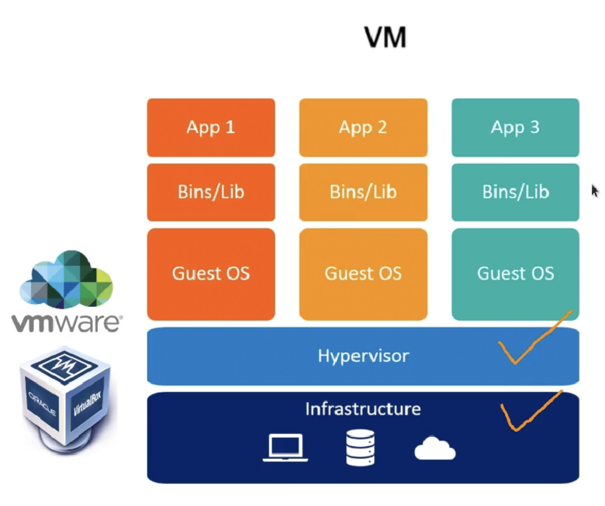
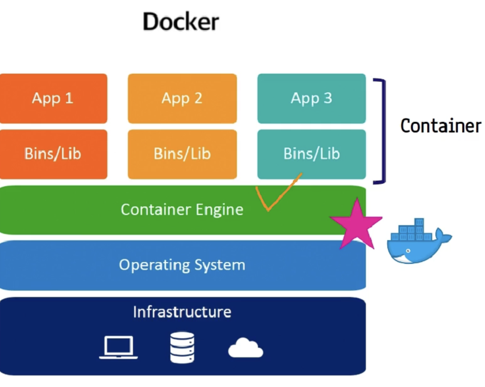

- VM 위에서 각각의 고립된 환경의 운영체제
- infrastructure의 리소스를 많이 잡아먹는다.
    

- 운영체제 위에 컨테이너 엔진(docker)을 달아 개별적인 app이 실행 가능하다.
- host OS 위에서 동작. 이 Host OS를 공유.
- 경량화된 구조

 

## docker Image
- 도커 이미지는 컨테이너 실행에 필요한 파일, 설정값 등을 포함
- 일종의 snapshot 형식으로 만들어진 후, 상태 값이 변화하지 않는다.(immutable)
- 하나의 이미지 -> 다수의 컨테이너 생성 가능

 docker image <- asset, version, configuration, dependency, ... 