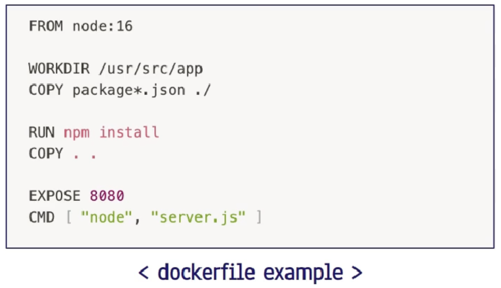

## docker file
- docker container의 필요한 정보들을 담아놓은 text파일
- docker image를 build하는 순서 및 방법 명시
- CLI 환경에서 docker image 생성 프로세스를 **자동화!**

- docker file은 기본적으로 캐싱 기능 사용
    - 변경 시점 이후로 update를 진행.
    - 때문에 변경이 잦은 것들을 뒷 부분에 넣는 것이 좋음.

 

## docker life cycle
Dockerfile - Docker Image - Docekr Container