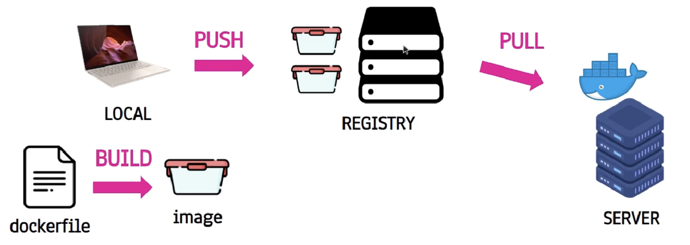

## Docker Registry
- docker image를 관리하는 일종의 저장소
- 종류
    - docker hub
    - aws (Amazon Elastic Container Registry ECR)
    - gcp (Artifact Registry)

 

## Dockerizing
- docker container를 사용하여 응용 프로그램을 패킹, 배포 및 실해앟는 프로세스
