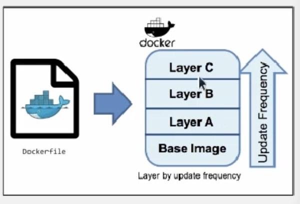
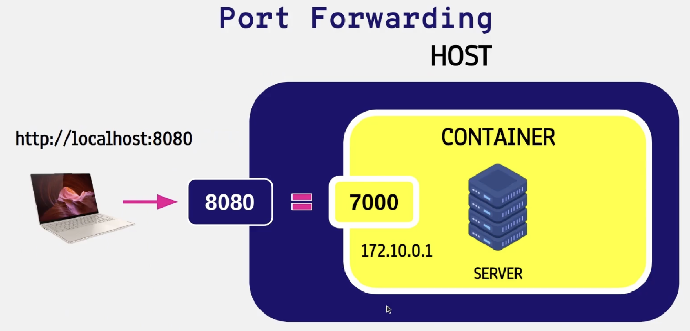

<ol>
<h3> 순서 </h3>
<li>nodejs express 다운로드</li>
<li>nodejs app 만들기</li>
<li>dockerfile을 만들어 dockerizing하기</li>
<li>app 구동</li>
<li>container 들여다 보기</li>
</ol>


### nodejs 다운로드 for Mac
```
brew install node@16 # Homebrew를 통해 Node.js의 16.x 버전을 설치
brew link node@16 # 설치된 node@16 버전을 시스템의 기본 버전으로 설정

node -v # Node.js의 버전을 확인
npm -v  # npm (Node Package Manager)의 버전을 확인

sudo npm install -g express # sudo 명령어를 사용하여 관리자 권한으로 Express 프레임워크를 전역적으로 설치
sudo npm install -g express-generator # sudo를 사용하여 관리자 권한으로 express-generator를 전역 설치
```


### nodejs 다운로드 for ubuntu
```
// node setting
curl -sL https://deb.nodesource.com/setup_16.x | sudo -E bash -
sudo apt-get install -y nodejs

// express setting
sudo npm install -g express
sudo npm install -g express-generator
```

### 간단한 코딩
```
    const express = require('express');

    const app = express();
    var port = 7000;

    app.get('/', (req, res) => {
        res.send('node js server by docker');
    });

    app.listen(port, (req, res) => {
        console.log('server is running now on '+ port);
    })
```

### Dockerfile
```
    FROM node:16-alpine    # base image 설정
    WORKDIR /app           
    # cd command와 동일. 컨테이너 내의 '/app' 디렉토리가 현재 작업 디렉토리로 설정
    COPY package*.json ./  # package*.json 파일을 현재 폴더(app)로 복사
    RUN npm install  # 현재 작업 디렉토리에서 'npm install' 명령을 실행
    COPY app.js ./  # app.js를 현재 폴더(app)으로 복사
    ENTRYPOINT ["node", "app.js"]  # 컨테이너가 시작될 때 실행할 명령을 지정
```

<br>

### Dockerfile build
```
    docker build -f Dockerfile -t [내가 지정할 이름]:tag [docker context path]
```

### container 구동
```
    docker run -d -p 8080:7000 [image 이름]:tag

    # -d : (detached) to run a container in background
    # -p : (port forward) to map a port of the container to the host port

```


<br>

### docker container 내부 들여다보기
```
    docker logs [docker container id]

    docker ps -a

    docker exec -it [docker container id] [bash/sh]
    # -it : 표준 입출력이 활성화된, 상호작용이 가능한 셸 환경 제공 옵션
```


### docker registry에 올리기(push)
```
    # docker hub의 규격에 맞게 이미지 변경하기
    docker tag [image name] [registry username]/[image name]:[tag name]

    # registry에 올리기
    docker push [registry username]/[image name]:[tag name]
```